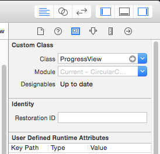

# CircularCompetion
iOS component writtern in swift to display progress 

Usage
========
1. Drag the <b>ProgressView.swift</b> file in your project.

2. Select the class name as `ProgressView` as shown in screenshot.      

3. You can change the progress by accessing the variable `progress` which takes the values between `0.0` and `1.0`

License
========
MIT

Screenshot
========

